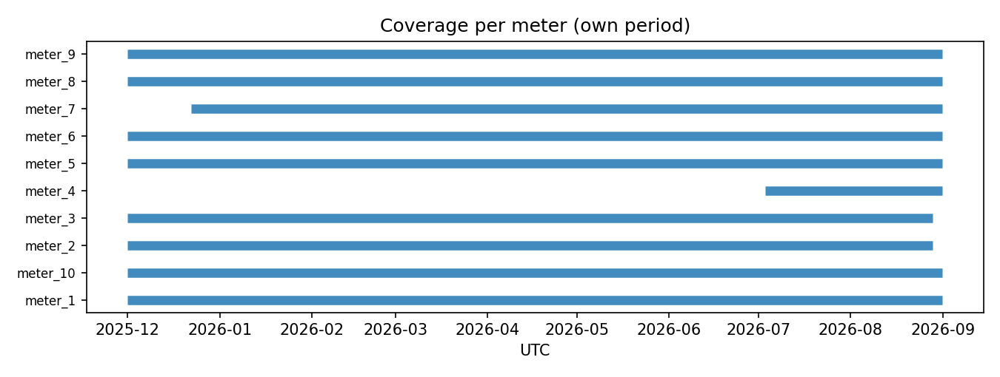
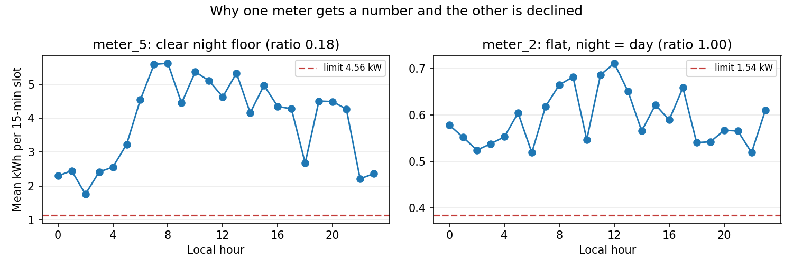
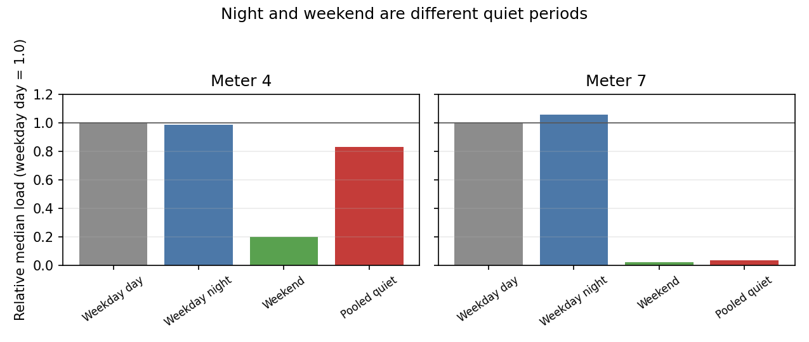

# Standby detection, first iteration

Eddie Beloiu, ecoplanet Data Engineer case study, 2026-09-23

> Ten anonymized electricity meters. A simple first detector, what it found for each meter, and where it could mislead a customer.

Python, pandas, matplotlib, Jupyter notebook. Private repo: TMFNK/ecoplanet.

This memo answers the five task questions. It gives the rule, the results, the limits, and the next steps. I keep the detector deliberately small.

> Main takeaway: The detector finds leads to investigate. It does not prove that a machine was wasting energy.

---

## The data

- Ten CSV files, one per meter. Each row is one 15-minute slot: timestamp plus kWh used in that slot.
- 239,699 readings in total, from December 2025 through September 2026.
- Coverage differs. Six meters cover the full period. Meters 2 and 3 stop four days early. Meter 7 starts three weeks late. Meter 4 covers only two months, Jul 3 to Sep 1.
- I checked the supplied files before choosing the rule. Every meter has a regular 15-minute UTC sequence, with no duplicate timestamps. Daylight saving creates a 75-minute jump in the local clock on March 29, while UTC stays regular. I sort by UTC and use local time for night and weekend.
- 2,554 readings are empty. The longest missing run is 17.7 days for meter 5 around Christmas; meter 4 has a five-day gap in August. All other missing runs are seven hours or shorter.
- 48,528 readings are exactly zero. Meter 9 is at zero 62.5% of the time, meter 1 at 60.4%, and meter 5 never reaches zero.

No meter shares a calendar. Six meters cover the full Dec-Sep period.
Meters 2 and 3 stop four days early, while meter 7 starts three weeks late, and meter 4 covers only July and August. Therefore, every total below is only for the shown period.

---

## What I checked before building (Task 3, part 1)

- Missing values. Missing stays missing. An empty cell never becomes a zero. I show it as unknown. Filling the gap would invent data. Meter 5 has a 17.7-day missing run around Christmas. Writing those rows as zero would create about 425 hours of fake zero use and hide the uncertainty.

- Zero values. Note that Zeros need separate care: Meter 2 is zero for 73 days straight at the end of its file. Meter 9 has one 132-day zero block. These look like long shutdowns or meter-off periods, not a machine left on at night.

  Meter 6 is the opposite: it has 239 zero values of an hour or more, and none lasts a full day. To me, that looks more like normal on-off cycling. I count zero hours separately and keep them out of the standby limit.

- Different scales. One limit for all ten meters cannot work. Their positive-reading medians differ by a factor of 898: meter 10 is 0.15 kWh per slot, while meter 6 is 135.76 kWh. A fixed limit would be too high for some meters and too low for others. I therefore set one limit per meter from that meter's own data.

---

## The rule (Task 1)

Simple on purpose. This is a first prototype, not a finished production model.

1. Convert the readings. I convert interval kWh to mean power by multiplying by 4. Each row covers 15 minutes, so this gives average kW for that slot. The limits are therefore easy to compare across meters.

2. Choose quiet periods. Quiet hours are defined as local night, 22:00 to 05:59, or any weekend hour. These are simple proxies for times when work may be off. (I used local time, not UTC, because 22:00 UTC is not always night in Germany after the clock change.)

3. Set one limit per meter. The limit is 4 times the 25th percentile of positive quiet readings for that meter. The lower quarter gives a rough floor without following one unusually low reading. I leave zeros out because they would pull the limit to zero on meters that are often off.

4. Require two low readings. A low reading counts only when it is part of two or more low readings in a row. A single low slot could be a short dip (or a bad reading). I think that two consecutive slots give a small amount of evidence that the lower load persisted.

5. Decline weak estimates. I decline the estimate when there are fewer than 200 positive quiet readings, or when the quiet median is more than half the weekday-day median. In either case I report no standby number, not zero. Fewer than 200 readings is only about 50 hours of evidence. A ratio above 0.5 means the quiet period is not clearly quieter. Meter 2 shows why: its ratio is 0.997, so night looks like day.

In the right panel, meter 2 is almost flat across the day. Its night readings are not a separate lower band, so the detector declines it.

> Excess means candidate low-load kWh above a 0 kWh off baseline. It is energy that might be saved, not proven waste. I use zero because the files contain no shift plan, rated power, or machine run signal to tell me what the true off level is.

---

## What I rejected (Task 3, part 2)

- One global limit. One global kW limit fails because the meters differ too much in size. Meter 9 peaks at 0.93 kWh per 15-minute slot, or 3.73 kW average power. Meter 6 peaks at 388.48 kWh per slot, or 1,553.92 kW average power. Therefore, one number would be meaningless across both.

- Quiet values that include zeros. Limits built from quiet values that include zeros also fail. Meters 1, 2, and 9 would get a limit of 0. Then no positive reading could count. I therefore use positive readings only.

- Calling zero “machine off.” I do not call zeros "machine off." Zero proves only that the meter recorded no energy in that slot. One meter may cover several machines, and I have no additional information or data.

- Machine learning or heavier tools. Machine learning, NILM, and clustering would add detail that the data cannot support. I have one total per slot and no sub-meters. A simple rule with clear limits is more honest for this case study.

- More infrastructure. I think that Pandas is enough for 239,699 rows, and the rule is only a few filters and groups. My time was spent on the judgment.

---

## Results (Task 2)

Every meter over the period it actually covers. There are no annualized numbers. All energy is for the shown period only.

"Declined" means the data did not show a clear quiet pattern; the reason is given below.

How to read the table:

- Missing: share of empty readings, kept as unknown.
- Zero hours: hours at exactly zero, kept apart from standby.
- Candidate standby hours: hours marked by my rule as possible standby.
- Excess kWh: candidate energy above a 0 kWh off baseline.
- Threshold (kW): the per-meter limit.
- Ratio: quiet median divided by weekday-day median.

| Meter | Period         | Missing | Zero hours | Candidate hours | Excess kWh | Threshold (kW) | Ratio | Status             |
| ----- | -------------- | ------- | ---------- | --------------- | ---------- | -------------- | ----- | ------------------ |
| 1     | Dec 1 → Sep 1  | 0.00%   | 3,972.25   | 197.25          | 122.14     | 2.356          | 0.385 | Estimated          |
| 2     | Dec 1 → Aug 28 | 0.00%   | 1,771.50   | n/a             | n/a        | 1.536          | 0.997 | Declined           |
| 3     | Dec 1 → Aug 28 | 0.00%   | 27.75      | n/a             | n/a        | 12.933         | 0.512 | Declined           |
| 4     | Jul 3 → Sep 1  | 8.66%   | 60.75      | n/a             | n/a        | 4.948          | 0.830 | Declined           |
| 5     | Dec 1 → Sep 1  | 7.40%   | 0.00       | 1,141.50        | 3,625.78   | 4.560          | 0.177 | Estimated          |
| 6     | Dec 1 → Sep 1  | 0.00%   | 1,325.25   | 1,010.00        | 91,195.84  | 145.920        | 0.362 | Estimated, on hold |
| 7     | Dec 22 → Sep 1 | 0.21%   | 587.25     | 700.25          | 148.53     | 0.574          | 0.036 | Estimated          |
| 8     | Dec 1 → Sep 1  | 0.00%   | 3.75       | 1,101.50        | 39,940.80  | 49.200         | 0.289 | Estimated, on hold |
| 9     | Dec 1 → Sep 1  | 0.12%   | 4,109.25   | n/a             | n/a        | 1.035          | 0.583 | Declined           |
| 10    | Dec 1 → Sep 1  | 0.11%   | 274.25     | n/a             | n/a        | 0.590          | 0.992 | Declined           |

Excess is low-load kWh above a 0 kWh baseline, the only baseline the files allow.
All periods run 2025 into 2026, and no meter is scaled to a full year.

---

## One line per meter (Task 2, continued)

- Meter 1: 60% of readings are zero, so the 3,972 zero hours matter more than the 197 standby hours.

- Meter 2: declined\*\*. Night looks just like day (ratio 0.997), so no quiet floor exists. I report the 1,772 zero hours on their own.

- Meter 3: declined. Its ratio is 0.512, just above the 0.5 gate, so I do not estimate.

- Meter 4: declined. Two months of data, busy nights, quiet weekends. Mixed together they hide the weekend split, and I never scale it to a full year.

- Meter 5: the clearest night floor and not a single zero. Best standby lead, though its Christmas weeks are missing, not low.

- Meter 6: a quieter band at plant size, 145.9 kW. This may be lower production rather than standby, so it stays on hold and off the customer dashboard.

- Meter 7: sharpest split in the set, quiet use at 3.6% of daytime. 700 standby hours, plus one 288 kWh spike I flagged for review and kept in the totals.

- Meter 8: a real quieter pattern, but still 49 kW of load. It stays on hold until I know what the meter covers.

- Meter 9: declined. Mostly off, 62.5% zeros, and no clear quiet pattern in its positive readings.

- Meter 10: declined. Flat near 0.15 kWh all day (ratio 0.992). Zero hours stand alone.

---

## How I treat uncertainty (Task 4, part 1)

- This is a screen, not a confidence score. Readings close in time are related, so I do not treat every row as a separate proof.

- Meter 3 is the boundary case. Its ratio is 0.512, only just above the 0.5 cutoff. A small change in the data or the cutoff could change the result, so declining is safer than presenting a number.

- Meter 1 is mostly zero. It is below the cutoff, but 60% of its readings are zero. The zero pattern is more important than its candidate hours.

- Meter 4 has little history. It has only about eight weeks of data and a gap inside that period. Its limit has little support, so I do not annualize it.

- The main uncertainty is the percentile. I show the threshold and the ratio next to every result so the reader can see the choice behind each number.

---

## Where the rule misleads (Task 4, part 2)

- Night and weekend are not one quiet time. Meter 4 proves it: weekday nights run at daytime level (0.99) while the whole weekend sits at 0.20. Mixed together they read 0.83 and the meter is declined, but split apart the weekend clears the bar on its own. Meter 3 shows the same mix effect: mixed 0.51, weekend 0.38. One shared bucket hides two different stories, so the next version has to treat them apart.

**Night and weekend are different quiet periods.** The bars show each period's median positive load divided by the weekday-day median. Meter 4 is quiet mainly at weekends. Meter 7 is quiet almost only at weekends. The pooled quiet period hides that difference.

- Meter 7 is quiet mainly at weekends. Its quiet time is weekends (0.023 of daytime), not weeknights (1.06). This looks like a weekend standby story, not a night one. Meters 6 and 8 act the same way: weeknights at or above daytime level, weekends clearly lower. A night-only rule would miss the real saving and chase a split that is not there.

- Long zero blocks follow the calendar, not a nightly cycle. Meter 2 is zero from Jun 16 to the end of its file, meter 9 has one 132-day block, and meter 1 is near zero over Christmas. A zero-hours score without block lengths could call a meter-off period a saving. That is why the table shows zero hours separately and the text gives the longest block: the length helps distinguish a long shutdown from a nightly pattern.

- The rule has no calendar. From Dec 20 to Jan 5, meter 2 runs 19% below its early-December baseline and meter 1 is at zero 91% of the time. Those are holidays, not better nights. Without a work calendar, a Christmas shutdown lands in the quiet hours wherever it falls and looks like standby saved. The fix needs a holiday list, not a smarter percentile.

---

## Critique (Task 4, part 3)

What I would not show a paying customer:

- Meters 6 and 8. They pass the numeric test with limits of 145.9 kW and 49.2 kW. Those levels could be plant operation rather than a standby load, but the files do not tell me what the meters cover. Both would stay on hold until I have more information. The 20 kW screen is my own safety choice, not a number learned from the data. It only says: above this, ask a person before calling it standby.

- Any standby number for the five declined meters. Zero hours only. Declined means I never found a clear quiet floor, and publishing zero kWh would sound exact and safe while hiding the real message, which is "we do not know".

- Full-year energy for meter 4. Two months with an 8.7% gap cannot speak for a year. Those two months are July and August, so they miss winter, miss Christmas, and rest on only 10 full weeks. Scaling them up would pretend summer is the whole year.

- A claim that meter 5 shows waste. It is the strongest lead, with 1,141 standby hours and no zeros to muddy the floor, but excess over a zero baseline assumes a plan the data never shows. That floor could be required cooling, IT, or a shared load. Without a schedule I can say "worth a visit", not "waste".

- A claim that zero-use means the machine was off. Without a shift plan or machine list, zero proves only that the meter recorded no use. Meter 2 is zero for the last 73 days of its file, which could be a planned shutdown or a meter-off period.

The standby numbers for meters 1, 5, and 7 are fine as leads to check. They are not proven customer numbers.

---

## Road forward (Task 5)

Each step fixes a problem above.

1. Separate night and weekend. Meters 4 and 3 have quiet weekends but busy nights. Separate limits would keep those two patterns from hiding each other.

2. Add asset and schedule data. Link each meter to a machine, rated power, and work calendar. Then standby means use while the plan says off, not simply use below a percentile. This replaces the guessed zero baseline with the site's real operating plan and helps screen out plant-scale loads like meters 6 and 8.

3. Use separate on and off limits. Add separate on and off limits so noise does not flip the result back and forth. Today one reading above the line breaks a run. Two limits with a small gap would keep the state steady.

4. Review spikes. Flag high spikes per meter for review and keep them in the energy totals until someone confirms an error. Meter 7 has one 288 kWh slot. Deleting it would lower the total without proof.

5. Make live results traceable. For live use, store raw data as-is with source and receive time. Use meter plus time as the fixed key. Mark late data as early or final, watch for missing and duplicate rows, and rerun only the changed time window. This keeps late fixes traceable without reprocessing everything.

### What I still need, and why

- Meter to machine and site. Which meter feeds which machine and site, and whether one meter mixes several machines. Without this, standby is a math floor, not proof a named machine should have been off.

- Rated power and always-on loads. I need to know about loads such as IT or heating. This separates required base load from waste and helps screen out plant-scale bands like meters 6 and 8.

- Shift plan and calendar. Shift plan, holidays, repair times, and planned stops keep Christmas and shutdown weeks out of the quiet hours and define "should be off" from real intent.

- Timestamp meaning. Whether each timestamp marks the start or the end of its slot. A 15-minute shift moves night borders and changes which rows count as quiet.

- Provider corrections. How late the provider sends data, how they fix errors, and when the data is final. I need this to mark early versus final rows, so late fixes do not rewrite published totals without a trace.

---

## Closing

- Notebook: `notebooks/EDA.ipynb` runs the same rule as `main.py`, writes the same two CSVs, and shows the duplicate and UTC-cadence check before fitting the rule.

- Command line: `python main.py --input data/raw --output outputs`

- New-meter test: A renamed copy of meter 7 gives the same 0.574 kW limit, the same hours, and the same excess with no code changes. The limit comes from the file; no meter ID is fixed in code.

- Unseen meter: `python main.py --input path/to/new.csv --output outputs/unseen`. The limit is fit from that file alone.

- Where to verify: Per-meter hours and energy sit in `outputs/meter_summary.csv`; limits, ratios, and reasons sit in `outputs/thresholds.csv`; the figures sit in `outputs/plots/`; the full walkthrough is `notebooks/EDA.ipynb`.

- Open assumptions: Timestamps are interval ends in local site time, one meter may cover several machines, empty means missing not zero, and the off baseline is 0 kWh because that is the only baseline the data allows.
